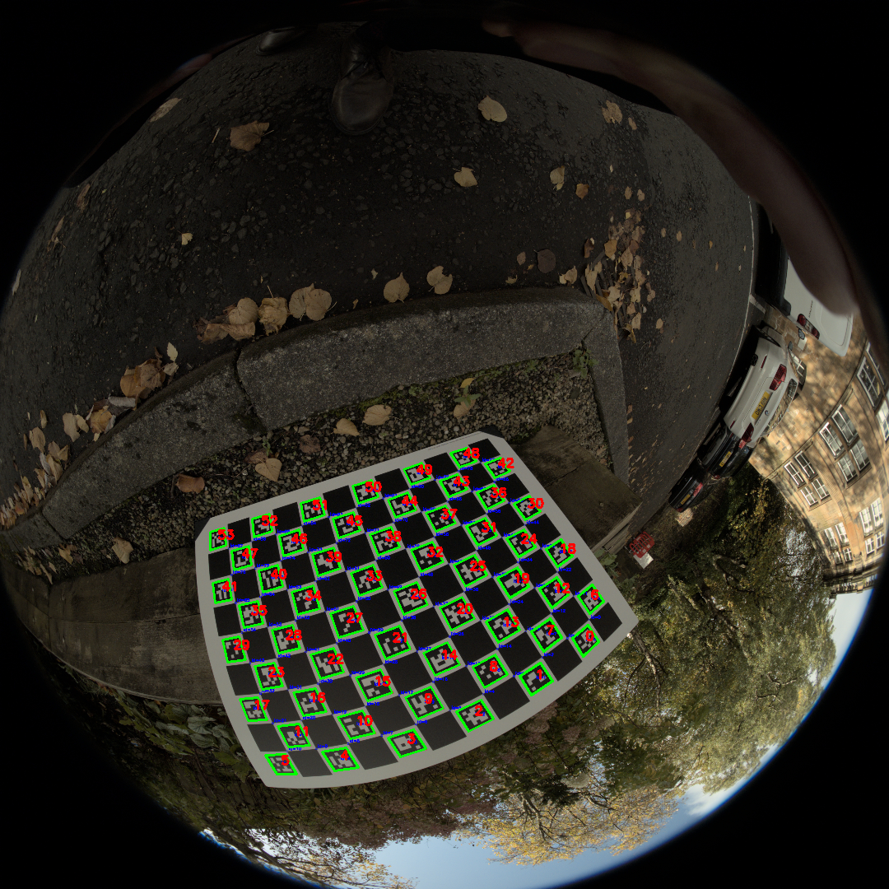

## Camera Calibrator

### Overview
This Python script provides a class for calibrating a camera using a ChArUco board. It allows calibration of fisheye cameras combining existing opencv modules of cv.aruco and cv.fisheye. It also has support for pinhole cameras.


### Dependencies
Venv Reconstruction

To recreate the virtual environment and install dependencies:

```
python -m venv myenv
source myenv/bin/activate  # macOS/Linux
myenv\Scripts\activate     # Windows
```

Install Dependencies:

```
pip install -r requirements.txt
```

Deactivate to exit the venv

```
deactivate
```


### Usage
1. **Import the class:**
   ```python
   import os
   import numpy as np
   import cv2
   import cv2.aruco
   import json

   from camera_calibrator import CameraCalibrator
   ```
2. **Create a CameraCalibrator instance:**
   ```python
   ARUCO_DICT = cv2.aruco.DICT_5X5_100
   SQUARES_VERTICALLY = 12
   SQUARES_HORIZONTALLY = 9
   SQUARE_LENGTH = 0.06
   MARKER_LENGTH = 0.045

   instaCam = CameraCalibrator(
       ARUCO_DICT, SQUARES_VERTICALLY, SQUARES_HORIZONTALLY, SQUARE_LENGTH, MARKER_LENGTH
   )
   instaCam.generate_charuco_board()
   ```
   Replace the parameters with the specific values for your ArUco board, you can generate the image to make sure the board is the same as in your images.
   
   

4. **Visualize ArUco markers (optional):**
   ```python
   file_paths = [os.path.join(PATH_TO_YOUR_IMAGES, f) for f in os.listdir(PATH_TO_YOUR_IMAGES) if f.endswith(".jpg")]
   instaCam.visualise_aruco_markers(file_paths, graysale=False, refine=True, refine_with_charuco=True, window_size=(1080,720))
   ```
   
    
    
    
   This function displays images with detected ArUco markers for visual inspection.
   
5. **Calibrate the camera:**
   ```python
   instaCam.calibrate(image_paths=file_paths, model='pinhole', output_path='calibration_pinhole.json')
   ```

   Replace `model` with `'fisheye'` for fisheye camera calibration.
6. **Undistort images:**
   ```python
   OUTPUT_PATH = os.path.join(CURRENT_PATH, '../data/calibration/undistorted')
   instaCam.undistort_images(file_paths, OUTPUT_PATH, 'calibration_pinhole.json', undistort_type=0, scale=0)
   ```
   Replace `calibration_file`, `undistort_type`, and `scale` as needed.

    


### Parameters
* `ARUCO_DICT`: The type of ArUco dictionary to use.
* `SQUARES_VERTICALLY`: Number of squares vertically on the ArUco board.
* `SQUARES_HORIZONTALLY`: Number of squares horizontally on the ArUco board.
* `SQUARE_LENGTH`: Length of a square on the ArUco board in meters.
* `MARKER_LENGTH`: Length of a marker on the ArUco board in meters.
* `model`: Camera model, either 'pinhole' or 'fisheye'.
* `output_path`: Path to save the calibration results.
* `undistort_type`: Type of undistortion (0: Pinhole, 1: Fisheye via RectifyMap, 2: Fisheye via Undistort).
* `scale`: Scaling factor for the undistorted image [0,1] with 1 including a greater fov.


By following these steps and customizing the parameters, you can effectively calibrate your camera and undistort images using this script.
 
**Remember to replace `PATH_TO_YOUR_IMAGES` and `CURRENT_PATH` with the actual paths to your images and the script directory.**
