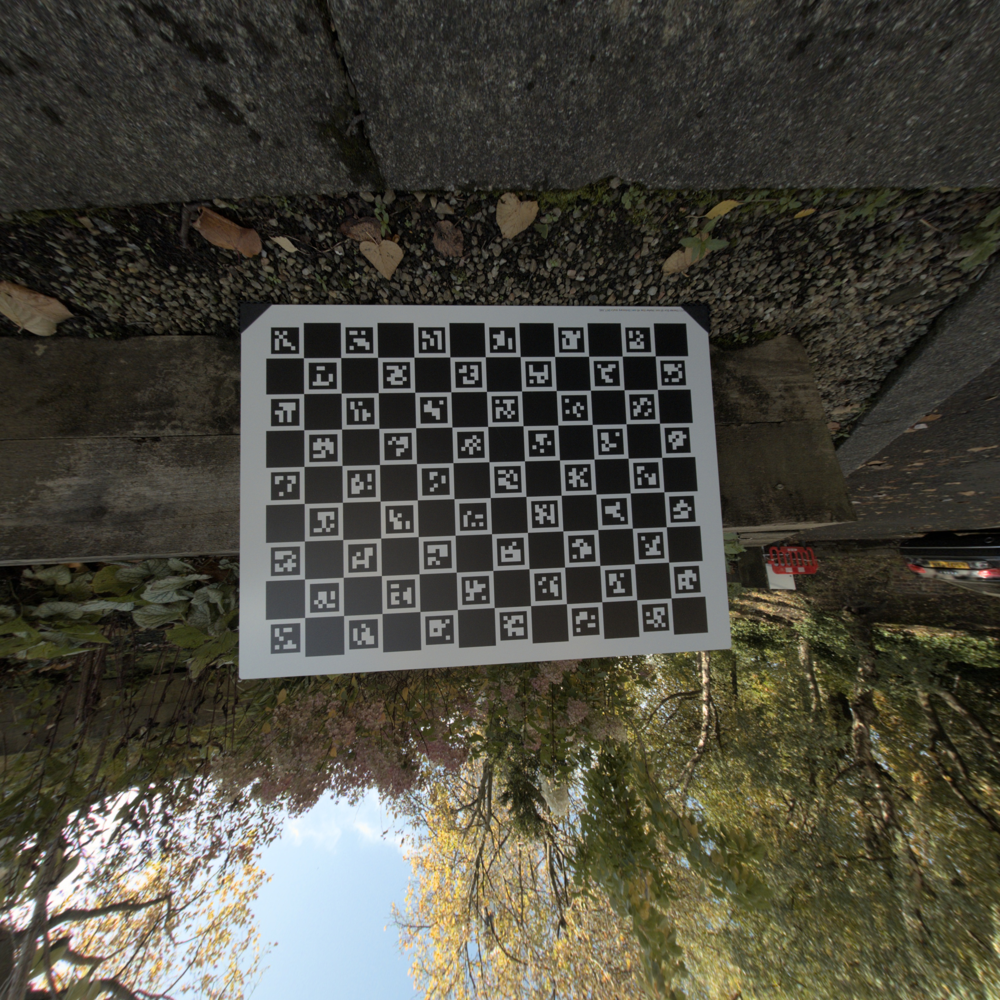
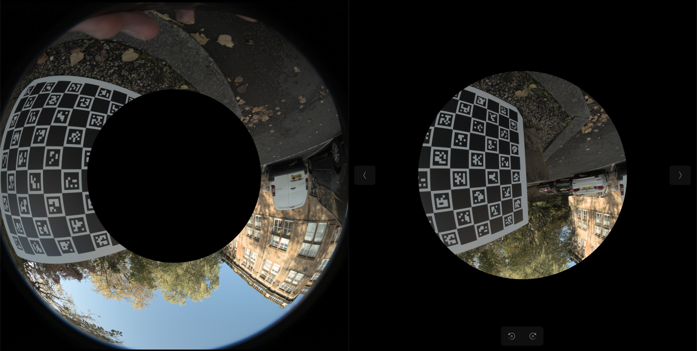

# Fisheye Charuco Calibration
### Overview
This Python script provides a class for calibrating a camera using a ChArUco board. It allows calibration of fisheye cameras combining existing opencv modules of cv.aruco and cv.fisheye. It also has support for pinhole cameras.


### Getting Started
To get up and running with the code base it is strongly suggested to use a virtual enviroment due to the specific versions of opencv and other libaries. This can be setup on using the following commands.
```
python -m venv myenv
source myenv/bin/activate  # macOS/Linux
myenv\Scripts\activate     # Windows

python -m pip install --upgrade pip  # reccomended but not essential
```
The enviroment can be deactivated by simply typing

```
deactivate
```

Now to install the package to get running
```
pip install setuptools
pip install -e .
```
All dependencies will now be installed and the modules can be installed in any python file in this venv.


### Structure
The Project is split up into the following folders, to get started place your calibration images into data/calibration/images and your images you wish to undistort into data/raw_images. All other folders will have information generated into.
```
├── data
│   ├── calibration
│   │   ├── camera_intrinsics
│   │   └── images
│   ├── raw_images
│   ├── undistorted_images
│   └── virtual_cameras
├── docs
│   └── README_images
├── scripts
├── src
│   ├── calibration
│   └── virtual_camera
└── tests
```
After adding your images to the correct folders there are common calibration and undistortion implementations available in the scripts folder that work out of the box for most cases. For help with understanding or troubleshooting an explaination of the core classes is provided below. If you do not have calibration images, a board can be generated on your screen using the code below and calibration images can be taken.

## ChArUco Board for Camera Calibration

A ChArUco board is a hybrid calibration pattern that combines chessboard patterns with ArUco markers. It offers several advantages over traditional calibration methods:

1. Robust detection even with partial occlusions
2. Automatic and accurate corner detection
3. Unique identification of each corner

### Generating a ChArUco Board

The `CharucoCalibrator` class provides methods to generate ChArUco boards:

```python
calibrator.generate_charuco_board()
```


This method creates a ChArUco board image and saves it as "charuco_board.png" in the data/calibration/ directory.

### Key Parameters

When initializing the calibrator, several parameters define the ChArUco board:

- `aruco_dict`: The ArUco dictionary to use (e.g., cv2.aruco.DICT_5X5_100)
- `squares_vertically`: Number of squares vertically in the ChArUco board
- `squares_horizontally`: Number of squares horizontally in the ChArUco board
- `square_length`: Physical length of each square in the ChArUco board (in your chosen unit, e.g., meters)
- `marker_length`: Physical length of each ArUco marker in the ChArUco board (in the same unit as square_length)

### Taking Calibration Photos

To achieve accurate calibration, follow these guidelines when capturing images of the ChArUco board:

1. Print the generated ChArUco board on a flat, rigid surface.
2. Ensure good, even lighting to avoid shadows or reflections.
3. Capture 10-20 images of the board from different angles and distances.
4. Cover the entire field of view of the camera in your images.
5. Include some images where the board is tilted or rotated.
6. Ensure the entire board is visible in most images.
7. Avoid motion blur by keeping the camera and board still during capture.

### Calibration Process

The calibration process involves these steps:

1. Generate and print the ChArUco board.
2. Take multiple photos of the board as described above.
3. Place the calibration images in the specified `calibration_images_dir`.
4. Run the `calibrate()` method of the `FisheyeCalibrator` or `PinholeCalibrator`.

### Additional Utilities

The `CharucoCalibrator` class provides additional methods for working with ChArUco boards:

- `generate_blank_board()`: Creates a blank black board for custom modifications.
- `detect_aruco_markers()`: Detects ArUco markers in an image.
- `detect_charuco_corners()`: Detects ChArUco corners in an image.
- `show_aruco_markers()`: Displays detected ArUco markers in an image.
- `show_charuco_corners()`: Displays detected ChArUco corners in an image.


These methods can be useful for verifying the quality of your calibration images and troubleshooting any issues in the calibration process.

## FisheyeCalibrator

The `FisheyeCalibrator` class is a specialized calibration tool designed for fisheye cameras. It inherits from the `CharucoCalibrator` base class and provides methods for calibrating fisheye cameras using ChArUco boards, undistorting fisheye images, and exporting camera parameters.

### Key Features

1. Fisheye-specific camera calibration
2. Image undistortion for fisheye lenses
3. Export of camera parameters in COLMAP format

### Usage

#### Initialization

```python
fisheye_calibrator = FisheyeCalibrator(
    aruco_dict,
    squares_vertically,
    squares_horizontally,
    square_length,
    marker_length,
    calibration_images_dir,
    raw_images_dir
)
```

#### Calibration

```python
fisheye_calibrator.calibrate(
    grayscale=True,
    calibration_filename='fisheye_calibration.json',
    window_size=(480, 480),
    verbose=False
)
```

This method performs the following steps:
1. Detects ChArUco corners in calibration images
2. Collects object points and image points
3. Performs fisheye camera calibration using cv2.fisheye.calibrate
4. Saves the calibration parameters to a JSON file

#### Image Undistortion


```python
undistorted_image = fisheye_calibrator.undistort_image(
    image,
    image_name=None,
    calibration_filename='fisheye_calibration.json',
    balance=1,
    show_image=True,
    save_image=True,
    output_path=None,
    window_size=(480, 480)
)
```

This method:
1. Loads calibration parameters
2. Undistorts the input image using cv2.fisheye.undistortImage
3. Optionally displays and saves the undistorted image

#### Exporting Camera Parameters

```python
fisheye_calibrator.export_camera_params_colmap(calibration_path=None)
```

This method exports the camera parameters in COLMAP format, which includes:
- Focal lengths (fx, fy)
- Principal point (cx, cy)
- Distortion coefficients (k1, k2, k3, k4)

### Key Methods

1. `calibrate()`: Performs fisheye camera calibration using ChArUco markers.
2. `undistort_image()`: Undistorts a fisheye image using calibrated parameters.
3. `export_camera_params_colmap()`: Exports camera parameters in COLMAP format.


## ConcentricCamera Class

The ConcentricCamera class is a virtual camera implementation designed to split images into concentric circular sections. This class is aimed to help split the calibration process into different fovs for ultra wide fisheye cameras as the outside may have differnt opencv distortion parameters to the center.

Features
- Concentric Splitting: Splits images into concentric circular sections based on specified radii ratios.
- Flexible Configuration: Allows configuration of multiple splits with customizable overlap ratios.
- Automated Processing: Automatically processes all images in the input folder and saves the segmented images into the designated output folder.



### Initialization

To use the ConcentricCamera class, you need to initialize it with the paths to your input and output folders, along with the desired splits and overlap ratio.
Parameters

- **input_folder (str):** Path to the folder containing input images. Images can be in formats like .jpg, .jpeg, .png, .bmp, and .tiff.
- **output_folder (str):** Path to the folder where processed images will be saved.
- **splits (list of float):** List of radii ratios (between 0 and 1) for splitting the image into concentric circles. Each ratio represents the outer radius of each concentric section as a proportion of the minimum image dimension (height or width).
- **overlap_ratio (float):** The ratio of overlap between adjacent sections. It defines how much the concentric circles overlap with each other.

```
concentric_cam = ConcentricCamera(
    input_folder="path/to/input/folder",
    output_folder="path/to/output/folder",
    splits=[0.3, 0.6, 0.9],
    overlap_ratio=0.1
)
```

### Create an instance of ConcentricCamera
```
concentric_cam = ConcentricCamera(
    input_folder="path/to/input/folder",
    output_folder="path/to/output/folder",
    splits=[0.5, 0.8], # Define splits as ratios
    overlap_ratio=0.05 # Define overlap ratio
)

# Process each image in the input folder
for image_path in concentric_cam.input_image_list:
    concentric_cam.split_image(image_path)
```

This code will read each image from the input folder, split it into concentric sections according to the specified radii ratios, and save the processed sections in the designated output folder. Each section is stored in a subdirectory named based on the split (e.g., camera_0, camera_1, etc.).
